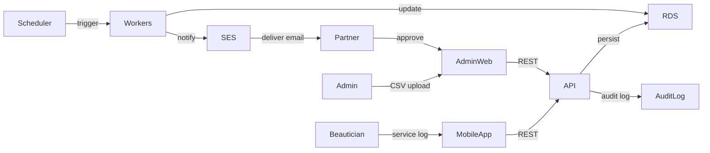
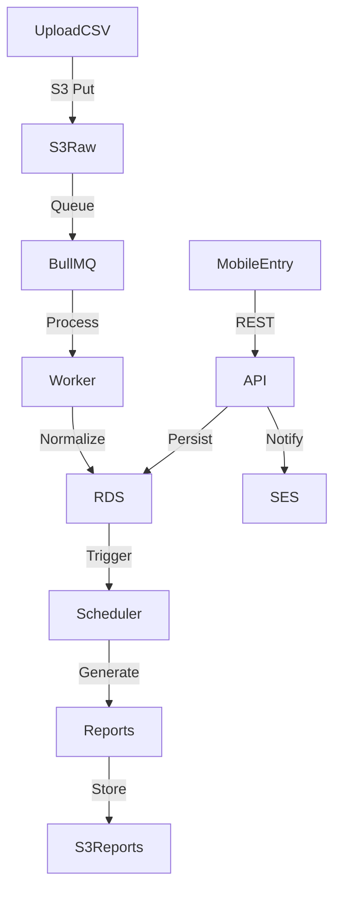
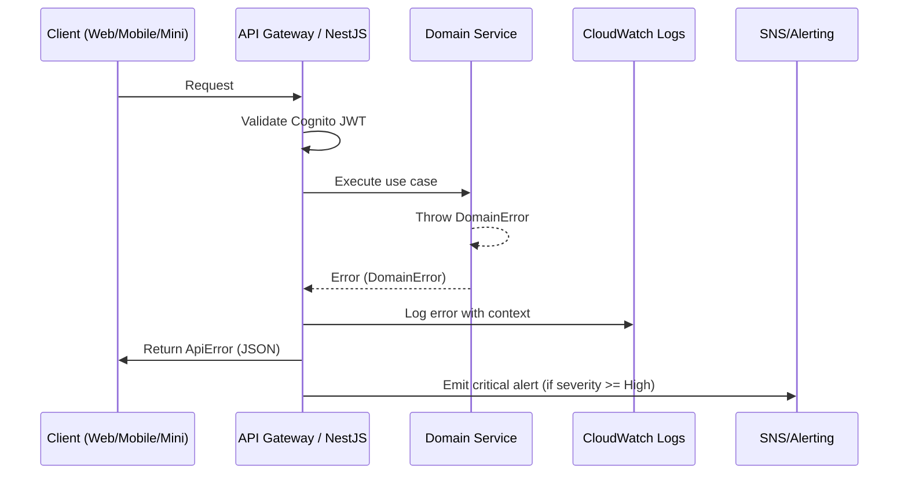

# beauty-shop-management-system Fullstack Architecture Document

> **Note**: This is an auto-generated merged version of the sharded architecture documents.
> For the latest version, see the individual files in `docs/architecture/`
> Generated on: 2025-09-26 12:00:48

## Introduction

This document outlines the complete fullstack architecture for beauty-shop-management-system, including backend systems, frontend implementation, and their integration. It serves as the single source of truth for AI-driven development, ensuring consistency across the entire technology stack.

This unified approach combines what would traditionally be separate backend and frontend architecture documents, streamlining the development process for modern fullstack applications where these concerns are increasingly intertwined.

## Starter Template or Existing Project

N/A – Greenfield project

## Change Log

| Date       | Version | Description                                                | Author  |
| ---------- | ------- | ---------------------------------------------------------- | ------- |
| 2025-09-25 | v0.1    | Initial fullstack architecture baseline                    | Winston |
| 2025-09-25 | v0.2    | Updated for Vite React frontend + cost-optimized AWS       | Winston |
| 2025-09-25 | v0.3    | Added appointment expectation module to align with PRD FR8 | Winston |

## High Level Architecture

## Technical Summary

beauty-shop-management-system adopts a modular, cost-conscious fullstack architecture anchored on AWS. The frontend surfaces include an admin web console built with Vite + React 19 + TypeScript and a React Native (Expo) mobile app; the WeChat mini program is deferred until demand justifies it. Backend services run on NestJS (TypeScript) packaged in Docker and deployed via AWS Elastic Beanstalk (single container mode) atop t4g.small instances for low operational cost. RESTful APIs are exposed through an Application Load Balancer secured with Cognito-issued JWTs. Core data resides in Amazon RDS for PostgreSQL (t4g.small, Multi-AZ), with Amazon S3 handling document storage and Amazon SES used for lightweight notifications. Security is enforced through Cognito for auth, VPC network isolation, KMS-encrypted storage, and CloudWatch logging. This setup keeps monthly spend lean while preserving a clean developer experience through a monorepo and shared TypeScript domain models.

## Platform and Infrastructure Choice

**Platform:** AWS (Primary)
**Key Services:** VPC (public/private subnets), Elastic Beanstalk (Docker), Application Load Balancer, Amazon RDS for PostgreSQL (Multi-AZ t4g.small), Amazon S3, Amazon Cognito, AWS Certificate Manager, AWS Secrets Manager, Amazon SES (notifications), Amazon CloudWatch Logs/Metrics, AWS Backup (snapshots), IAM
**Deployment Host and Regions:** ap-southeast-2 (Sydney) primary with automated backups replicated to ap-northeast-1 (Tokyo)

**Rationale:**

- Elastic Beanstalk abstracts EC2/ALB provisioning while allowing cost control via Graviton (t4g) instances.
- RDS for PostgreSQL provides managed backups and Multi-AZ at lower cost than Aurora.
- Cognito’s free tier covers initial user volume, integrates with React and React Native clients, and supports future MFA.
- Removing optional services (WAF, GuardDuty, EventBridge, SQS) keeps the stack simple; security relies on private subnets, security groups, and IAM least privilege.
- SES offers cost-effective email notifications; SMS/WeChat can be added later if needed.

## Repository Structure

Adopt an Nx-powered monorepo (pnpm workspace) to maximize code sharing across web, mobile, backend services, shared libraries, and infrastructure-as-code. Use npm as the default package manager for production deployments (pnpm can remain as optional dev tool if team prefers, but npm lockfile will be canonical).

```
/beauty-shop-management-system
  apps/
    admin-web/            # Vite + React 19 (TypeScript)
    mobile-app/           # React Native (Expo Managed)
    api-gateway/          # NestJS application (REST + background workers)
    batch-jobs/           # Scheduled workers for reconciliation, exports
  libs/
    domain/               # Shared domain models, validation schemas (Zod)
    ui/                   # Shared UI components (React Native Web compatible)
    data-access/          # API clients, GraphQL hooks (if added later)
    auth/                 # Cognito wrappers, permission helpers
    infra/                # CDK constructs, IaC utilities
  infra/
    cdk/                  # AWS CDK stacks (network, database, services)
    pipelines/            # CI/CD definitions
  scripts/
    db-migrations/
    analytics/
  tools/
  package.json
  pnpm-workspace.yaml
  nx.json
  turbo.json
```

## Runtime Component Stack

- **Frontend**

  - Admin Web: Vite 5 + React 19 + TypeScript, TanStack Query, Zustand, React Hook Form; UI 由 shadcn/ui（Radix + Tailwind）驱动，并通过 Tremor + Recharts 封装统计图表组件
  - Mobile App: React Native + Expo, React Query + Zustand, NativeBase component library, Expo SecureStore for token storage

- **Backend**

  - NestJS (Node 20) packaged as Docker container, deployed via AWS Elastic Beanstalk (single-container)
  - RESTful APIs behind Application Load Balancer; no API Gateway to reduce cost/latency
  - Background jobs using Nest Schedule (cron) and BullMQ (Redis) running inside the same service cluster (optionally Redis hosted via ElastiCache or self-managed)
  - Data layer using Prisma ORM targeting PostgreSQL

- **Database & Storage**

  - Amazon RDS for PostgreSQL (t4g.small Multi-AZ) as single source of truth
  - Amazon S3 for receipt/document storage with lifecycle policies to Intelligent-Tiering
  - (Optional later) Amazon Glacier for long-term archival if compliance requires

- **Integration & Messaging**

  - Email notifications via Amazon SES
  - In-app notifications stored in PostgreSQL; push notifications via Expo push service

- **Identity & Access**

  - Cognito User Pools for partner, store manager, beautician roles; future federation ready
  - IAM roles with least privilege; Secrets Manager for database credentials

- **DevEx & Tooling**
  - npm + Nx for monorepo management (pnpm optional for dev caching)
  - Storybook for admin UI + NativeBase components, MSW for API mocking
  - ESLint + Prettier + lint-staged（配置集中在 `tools/config`）：提交前强制执行 `npm run lint` / `npm run format`，统一代码风格

## High-Level Architecture Diagram

```mermaid
graph TD
  subgraph Client
    A[Admin Web (Vite + React)]
    B[Mobile App (React Native)]
  end

  subgraph Identity
    Cognito[(AWS Cognito)]
  end

  subgraph API Layer
    ALB[Application Load Balancer]
  end

  subgraph Services
    Beanstalk[Elastic Beanstalk - NestJS]
    Scheduler[Nest Scheduled Jobs]
    Redis[(Redis/BullMQ optional)]
  end

  subgraph Data
    RDS[(RDS PostgreSQL)]
    S3Data[(S3 Receipts)]
    Secrets[Secrets Manager]
  end

  subgraph Observability
    CloudWatch
    Sentry[(Sentry Optional)]
  end

  A --> ALB
  B --> ALB
  ALB --> Beanstalk
  Cognito --> A
  Cognito --> B
  Beanstalk --> RDS
  Beanstalk --> S3Data
  Scheduler --> Beanstalk
  Beanstalk --> CloudWatch
  Secrets --> Beanstalk
  Beanstalk --> Sentry
```

## Technology Stack

## Frontend Stack

### Admin Web (Vite + React)

- **Build Tool**: Vite 5
- **Framework**: React 19 with TypeScript
- **State Management**: Zustand
- **Data Fetching**: TanStack Query (React Query)
- **Forms**: React Hook Form + Zod validation
- **UI Components**:
  - shadcn/ui (Radix UI + Tailwind CSS)
  - Tremor for dashboard components
  - Recharts for data visualization
- **Styling**: Tailwind CSS
- **Testing**: Vitest, React Testing Library, Playwright (E2E)

### Mobile App (React Native)

- **Framework**: React Native with Expo (Managed Workflow)
- **State Management**: Zustand
- **Data Fetching**: TanStack Query
- **UI Components**: NativeBase
- **Navigation**: React Navigation
- **Storage**: Expo SecureStore (tokens), AsyncStorage (cache)
- **Testing**: Jest, React Native Testing Library, Detox (E2E)

## Backend Stack

### API Services (NestJS)

- **Runtime**: Node.js 20 LTS
- **Framework**: NestJS (TypeScript)
- **API Style**: RESTful
- **Database ORM**: Prisma
- **Validation**: class-validator, class-transformer
- **Documentation**: Swagger/OpenAPI
- **Queue**: BullMQ with Redis (optional)
- **Scheduling**: Nest Schedule (cron jobs)
- **Testing**: Jest, Supertest

### Database & Storage

- **Primary Database**: PostgreSQL 15 (Amazon RDS)
- **Cache**: Redis (ElastiCache or self-managed)
- **Object Storage**: Amazon S3
- **File Processing**: Sharp (images), PDFKit (documents)

## Infrastructure & DevOps

### AWS Services

- **Compute**: Elastic Beanstalk (t4g.small Graviton instances)
- **Load Balancing**: Application Load Balancer (ALB)
- **Database**: RDS for PostgreSQL (Multi-AZ)
- **Storage**: S3 with Intelligent-Tiering
- **Identity**: Cognito User Pools
- **Secrets**: AWS Secrets Manager
- **Monitoring**: CloudWatch Logs/Metrics
- **Email**: Amazon SES
- **Backup**: AWS Backup
- **Network**: VPC with public/private subnets

### Development Tools

- **Monorepo**: Nx workspace
- **Package Manager**: npm (production), pnpm (optional dev)
- **Version Control**: Git
- **CI/CD**: GitHub Actions
- **Container**: Docker
- **IaC**: AWS CDK (TypeScript)

## Shared Libraries

### Domain Layer

- **Validation**: Zod schemas
- **Types**: TypeScript interfaces/types
- **Constants**: Shared enums and constants
- **Utilities**: Date/number formatters, validators

### Authentication

- **JWT**: Cognito token validation
- **Permissions**: RBAC utilities
- **Session**: Token refresh logic

### Data Access

- **API Client**: Axios with interceptors
- **Error Handling**: Standardized error types
- **Retry Logic**: Exponential backoff

## Development Standards

### Code Quality

- **Linting**: ESLint with TypeScript rules
- **Formatting**: Prettier
- **Git Hooks**: Husky + lint-staged
- **Commit Convention**: Conventional Commits

### Testing Strategy

- **Unit Tests**: 80% coverage target
- **Integration Tests**: API endpoints
- **E2E Tests**: Critical user flows
- **Performance**: k6 for load testing

### Documentation

- **API**: Swagger/OpenAPI specs
- **Components**: Storybook
- **Architecture**: ADRs (Architecture Decision Records)

## Version Requirements

```json
{
  "node": ">=20.0.0",
  "npm": ">=10.0.0",
  "postgresql": "15.x",
  "redis": "7.x"
}
```

## Browser Support

- Chrome/Edge: Latest 2 versions
- Safari: Latest 2 versions
- Firefox: Latest 2 versions
- Mobile: iOS 14+, Android 10+

## Source Tree Structure

## Monorepo Organization

The beauty-shop-management-system uses an Nx-powered monorepo structure to maximize code sharing and maintain consistency across all applications and services.

```
/beauty-shop-management-system/
├── apps/                         # Application projects
│   ├── admin-web/               # Vite React admin dashboard
│   │   ├── src/
│   │   │   ├── app/           # Application shell
│   │   │   ├── pages/         # Route pages
│   │   │   ├── components/    # Local components
│   │   │   ├── hooks/         # Custom React hooks
│   │   │   ├── services/      # API integrations
│   │   │   └── styles/        # Global styles
│   │   ├── public/             # Static assets
│   │   └── vite.config.ts
│   │
│   ├── mobile-app/             # React Native mobile app
│   │   ├── src/
│   │   │   ├── screens/       # Screen components
│   │   │   ├── navigation/    # Navigation config
│   │   │   ├── components/    # Local components
│   │   │   └── services/      # API integrations
│   │   ├── app.json           # Expo config
│   │   └── metro.config.js
│   │
│   ├── api-gateway/            # NestJS REST API
│   │   ├── src/
│   │   │   ├── modules/       # Feature modules
│   │   │   ├── common/        # Shared utilities
│   │   │   ├── config/        # Configuration
│   │   │   └── main.ts        # Application entry
│   │   ├── test/              # E2E tests
│   │   └── Dockerfile
│   │
│   └── batch-jobs/             # Background workers
│       ├── src/
│       │   ├── jobs/          # Job definitions
│       │   ├── schedulers/    # Cron schedulers
│       │   └── processors/    # Queue processors
│       └── Dockerfile
│
├── libs/                        # Shared libraries
│   ├── domain/                # Core business logic
│   │   ├── src/
│   │   │   ├── models/       # Domain models
│   │   │   ├── schemas/      # Zod validation
│   │   │   ├── constants/    # Shared constants
│   │   │   └── utils/        # Business utilities
│   │   └── index.ts
│   │
│   ├── ui/                    # Shared UI components
│   │   ├── src/
│   │   │   ├── components/   # Cross-platform components
│   │   │   ├── themes/       # Design tokens
│   │   │   └── hooks/        # Shared React hooks
│   │   └── index.ts
│   │
│   ├── data-access/           # API client libraries
│   │   ├── src/
│   │   │   ├── api/          # API endpoints
│   │   │   ├── hooks/        # React Query hooks
│   │   │   └── types/        # API types
│   │   └── index.ts
│   │
│   ├── auth/                  # Authentication utilities
│   │   ├── src/
│   │   │   ├── cognito/      # Cognito integration
│   │   │   ├── guards/       # Auth guards
│   │   │   └── permissions/  # RBAC utilities
│   │   └── index.ts
│   │
│   └── infra/                 # Infrastructure utilities
│       ├── src/
│       │   ├── cdk/          # CDK constructs
│       │   └── utils/        # IaC helpers
│       └── index.ts
│
├── infra/                      # Infrastructure as Code
│   ├── cdk/                   # AWS CDK definitions
│   │   ├── bin/              # CDK app entry
│   │   ├── lib/              # Stack definitions
│   │   │   ├── network/      # VPC, subnets
│   │   │   ├── compute/      # Beanstalk, ALB
│   │   │   ├── database/     # RDS, Redis
│   │   │   └── storage/      # S3 buckets
│   │   └── cdk.json
│   │
│   └── pipelines/             # CI/CD definitions
│       ├── github/           # GitHub Actions
│       └── scripts/          # Deployment scripts
│
├── scripts/                    # Utility scripts
│   ├── db-migrations/         # Database migrations
│   │   └── prisma/
│   │       ├── schema.prisma
│   │       └── migrations/
│   ├── analytics/             # Analytics scripts
│   └── setup/                 # Development setup
│
├── tools/                      # Build & development tools
│   ├── config/                # Shared configurations
│   │   ├── eslint/           # ESLint rules
│   │   ├── prettier/         # Prettier config
│   │   └── jest/             # Jest presets
│   └── generators/            # Nx generators
│
├── docs/                       # Documentation
│   ├── architecture/          # Architecture docs
│   ├── prd/                  # Product requirements
│   ├── stories/              # User stories
│   └── qa/                   # QA documentation
│
├── .bmad-core/                # BMAD framework
│   ├── agents/               # AI agents
│   ├── tasks/                # Task definitions
│   └── templates/            # Templates
│
├── docker-compose.yml         # Local development
├── nx.json                    # Nx configuration
├── package.json              # Root package.json
├── tsconfig.base.json        # Base TypeScript config
└── README.md                 # Project documentation
```

## Key Directories

### Applications (`/apps`)

Each application is self-contained with its own configuration but shares common libraries:

- **admin-web**: Vite-based React admin dashboard
- **mobile-app**: Expo-managed React Native app
- **api-gateway**: NestJS REST API service
- **batch-jobs**: Background job processors

### Shared Libraries (`/libs`)

Reusable code shared across applications:

- **domain**: Core business logic and models
- **ui**: Shared UI components (React/React Native)
- **data-access**: API clients and data fetching
- **auth**: Authentication and authorization
- **infra**: Infrastructure utilities

### Infrastructure (`/infra`)

Infrastructure as Code and deployment:

- **cdk**: AWS CDK stack definitions
- **pipelines**: CI/CD pipeline configurations

### Scripts (`/scripts`)

Automation and utility scripts:

- **db-migrations**: Prisma schema and migrations
- **analytics**: Data analysis scripts
- **setup**: Development environment setup

### Tools (`/tools`)

Development tooling configuration:

- **config**: Centralized tool configurations
- **generators**: Custom Nx workspace generators

## File Naming Conventions

### TypeScript/JavaScript

- **Components**: PascalCase (e.g., `UserProfile.tsx`)
- **Utilities**: camelCase (e.g., `formatDate.ts`)
- **Constants**: UPPER_SNAKE_CASE in files (e.g., `API_ENDPOINTS.ts`)
- **Hooks**: camelCase with `use` prefix (e.g., `useAuth.ts`)
- **Types/Interfaces**: PascalCase with `.types.ts` suffix

### Folders

- **Feature modules**: kebab-case (e.g., `user-management/`)
- **Shared utilities**: lowercase (e.g., `utils/`, `helpers/`)

### Test Files

- **Unit tests**: `*.spec.ts` or `*.test.ts`
- **E2E tests**: `*.e2e-spec.ts`
- **Test fixtures**: `*.fixture.ts`

## Import Path Aliases

Configured in `tsconfig.base.json`:

```typescript
{
  "paths": {
    "@beauty/domain": ["libs/domain/src/index.ts"],
    "@beauty/ui": ["libs/ui/src/index.ts"],
    "@beauty/data-access": ["libs/data-access/src/index.ts"],
    "@beauty/auth": ["libs/auth/src/index.ts"],
    "@beauty/infra": ["libs/infra/src/index.ts"]
  }
}
```

## Module Boundaries

Nx enforces module boundaries to maintain clean architecture:

- Apps can import from libs
- Libs cannot import from apps
- Domain lib cannot import from other libs
- UI lib can only import from domain
- Data-access can import from domain and auth

## Build Artifacts

Generated build outputs:

- `/dist/apps/` - Compiled applications
- `/dist/libs/` - Compiled libraries
- `/coverage/` - Test coverage reports
- `/storybook-static/` - Built Storybook

## Functional Architecture

## Domain Capability Breakdown

1. **Revenue Management**

   - Capture daily revenue per store & beautician (manual upload, future real-time)
   - Reconciliation against appointments, identify anomalies (under-reporting)
   - Generate daily close, trend analysis, service mix insights

2. **Appointment & Expectation Management**

   - Allow partners/store managers to register expected services/appointments with planned time, beautician, service type, and target revenue
   - Provide API/UI for editing, cancelling, and tracking fulfilment status
   - Feed comparison engine that powers anomaly detection and cash variance workflows

3. **Cost Management**

   - Manual/OCR cost entry, categorize by store & payer
   - Automatic allocation rules (per store) feeding profit calculations
   - Cost approval workflow, audit trail, supporting document storage

4. **Cash Flow & Settlement**

   - Cash handover batching, multi-day cycles, variance tracking
   - Profit split calculations (per partner) after cost allocation
   - Support for subsidy adjustments

5. **Exception & Compliance**
   - Anomaly detection rules (time, amount variance, missing handover)
   - Escalation workflow with audit logging

- Exportable compliance reports, immutable log in PostgreSQL audit partitions

6. **Analytics & Reporting**
   - Daily/Monthly summaries (predefined & custom queries)
   - Drill-down by store, beautician, category

- Export to Excel/PDF, scheduled delivery via SES email (WeChat optional in future)

7. **Authentication & Authorization**
   - Role-based access (Partner, Store Manager, Beautician, Finance)
   - Fine-grained store scoping, row-level filtering via JWT claims
   - Audit log for all sensitive operations

## User Journeys & Integration Points

- 合伙人或门店管理员在日初登记预约/预期服务 → API 保存 `ExpectedServiceSession` → 为当日对账提供基准。
- Beautician records service completion (mobile app) → API posts `ServiceSession` → triggers reconciliation jobs。
- Store manager uploads daily CSV via admin web → API processes batch → stores raw in S3, populates normalized tables。
- Comparison engine compares expected vs. actual sessions & cash → raises anomalies for partner review。
- Partner reviews daily dashboard → queries aggregated metrics via API → sees open exceptions, cash batch status。
- Finance triggers OCR pipeline for cost receipts → background worker queue processes job → updates cost ledger。
- Cash batch closed → API generates settlement report → S3 signed URL + SES email notification to partners。

## Solution Overview Diagram



## Frontend Architecture

-### Admin Web (Vite + React)

- **Framework:** Vite 5 + React 19 + TypeScript, React Router v6, TanStack Query, Zustand, React Hook Form + Zod
- **Styling & Components:** Tailwind CSS + shadcn/ui（Radix primitives），自建 `libs/ui/components` 封装表单、数据表、抽屉等复合组件
- **Authentication:** Cognito Hosted UI (PKCE) → tokens stored in httpOnly cookies via lightweight BFF proxy within Nest; fallback to refresh-token rotation in SecureStore for mobile
- **Routing:** React Router nested routes with role-based guards; lazy loading per module
- **Data Fetching:** Axios-based SDK generated from OpenAPI; SSE/long polling for batch status updates
- **Hosting:** Vite build artifacts served as static assets by the NestJS API service (Express static middleware) so the ALB handles both UI and API traffic without extra hosting cost
- **Testing:** Playwright (E2E) + Jest + React Testing Library; Storybook for UI regression testing
- **Key Modules:** 收入/成本录入向导、预约/预期服务登记、现金交接批次、异常看板与报表中心。

## Mobile App (React Native + Expo)

- **Structure:** Expo Managed workflow, TypeScript, React Navigation
- **State/Data:** React Query + Zustand with offline cache (AsyncStorage) and background sync
- **Auth:** Cognito with PKCE flow and refresh tokens stored via Expo SecureStore
- **Integrations:** Camera & DocumentPicker for receipt capture; push notifications via Expo Push + SSE fallback
- **Styling & Components:** NativeBase 3 结合自定义 theme，与 Web 端 shadcn 共享 design tokens（颜色/排版/间距）以保持品牌一致
- **Distribution:** EAS Build/Submit + OTA updates with Expo Updates
- **Key Workflows:** 美容师录入服务与现金交接、补贴申请、查看预约任务与异常提醒。

## Shared UI & SDK

- Shared UI primitives 在 `libs/ui` 中维护：
  - `libs/ui/shadcn`：shadcn/ui 生成的基础组件与 Tailwind 主题（以 design tokens 抽离变量）
  - `libs/ui/charts`：封装 Tremor + Recharts 组合图表（折线、柱状、饼图、漏斗等），对外暴露 `<ChartCard>`, `<TrendChart>` 等统一 API
  - `libs/ui/native`：React Native (NativeBase) 组件主题，与 Web 共享颜色/间距 token
- Shared API SDK generated from OpenAPI definitions using Orval/Swagger Codegen; shared validation schemas in `libs/domain`
- **UI Design References:**
  - [UI/UX Specification](../front-end-spec.md) - Complete design system and component specifications
  - [ASCII Layout Designs](../ui-design/ascii-layouts.md) - Detailed wireframes for all screens
  - [UI Generation Prompts](../ui-prompts.md) - AI-ready prompts for UI implementation

### UI Library Setup Guidelines

- 安装 shadcn/ui CLI (`npx shadcn-ui@latest init`) 并将生成的组件输出目录指向 `libs/ui/shadcn`，所有新增组件统一通过 CLI 添加，避免在各 app 内部散落拷贝。
- 在 `libs/ui/theme` 中维护 Tailwind CSS 配置与 design tokens（颜色、字体、间距等），导出给 Web 端 (Tailwind config) 与 NativeBase theme 使用，确保跨端一致性。
- 图表组件层：
  - 底层库选 Tremor (`@tremor/react`) 作为快速仪表盘组件，针对特殊需求使用 Recharts。所有调用都通过 `libs/ui/charts` 暴露的包装组件。
  - 包装组件需接收统一的 `data`, `series`, `variant` props，内部将色板映射到 design tokens。
- Storybook：
  - 在根目录配置 Storybook 并注入 Tailwind/shadcn 主题；为 `libs/ui` 中的每个组件（包含 chart wrapper）提供故事，确保视觉回归。
- NativeBase：在 `libs/ui/native` 中定义 `nativeBaseTheme`，使用与 Tailwind 同步的 token（可以通过 JSON 导出），移动端组件均从该主题派生。

## Backend Architecture

## Service Breakdown

- **API Service (NestJS on Elastic Beanstalk)**

  - Domain modules: Auth, Appointments, Revenue, Cost, CashFlow, Reporting, Exception, Notifications
  - Exposes REST endpoints with OpenAPI spec auto-generated via Swagger module
  - Cognito JWT guard with role + store-scope decorators
  - Prisma as ORM; connection pooling handled via pgBouncer sidecar or RDS Proxy (optional)

- **Background Jobs**

  - Nest Schedule for cron jobs (daily close, report generation)
  - BullMQ queues (Redis) for long-running tasks like CSV ingestion、预约 vs. 实际对账、以及 OCR (phase 2)
  - Workers deployed as separate Beanstalk environment (worker tier) sharing the same codebase

- **OCR Pipeline (Phase 2)**
  - S3 upload triggers worker job via BullMQ queue; OCR processed by third-party API or AWS Textract invoked from worker

## API Layer

- RESTful endpoints grouped by domain under `/api/v1`
- DTOs validated via class-validator and Zod for additional runtime safety
- Pagination via cursor-based pattern for audit-heavy endpoints
- Rate limiting using Nest rate-limiter guard + ALB listener rules
- Webhook endpoints (future) for partner integrations; currently disabled

## Integration Contracts

- OpenAPI YAML committed to repo, drives SDK generation across web/mobile
- Event schemas documented for internal queues (BullMQ job payloads)

## Data Architecture

## Core Entities

- `stores` – metadata per store, region, operating hours
- `users` – Cognito user mapping, role assignments, store scopes
- `beauticians` – profile, commission rate, status
- `service_sessions` – service entry, store_id, beautician_id, duration, revenue, payment method
- `expected_service_sessions` – planned services/appointments with store_id, beautician_id, scheduled_time, expected revenue & duration
- `daily_revenue_entries` – normalized daily submissions, linked to uploaded files
- `cost_entries` – cost records, category, payer, allocation rule id
- `cash_handover_batches` – batch info, period, expected/actual, status, attachments
- `cash_handover_items` – linking service sessions to batch, variance detail
- `subsidies` – subsidy records per beautician/date
- `exceptions` – anomaly events, classification, status, assigned_to
- `reports` – cached report metadata with signed URLs
- `audit_logs` – append-only events stored in PostgreSQL partitioned table

## Data Flow Diagram



## Database Schema Snapshot (PostgreSQL)

```sql
CREATE TABLE stores (
  id UUID PRIMARY KEY,
  code TEXT UNIQUE NOT NULL,
  name TEXT NOT NULL,
  region TEXT,
  timezone TEXT NOT NULL DEFAULT 'Australia/Sydney',
  status TEXT NOT NULL DEFAULT 'active',
  created_at TIMESTAMPTZ NOT NULL DEFAULT NOW(),
  updated_at TIMESTAMPTZ NOT NULL DEFAULT NOW()
);

CREATE TABLE users (
  id UUID PRIMARY KEY,
  cognito_sub TEXT UNIQUE NOT NULL,
  email TEXT,
  phone TEXT,
  display_name TEXT,
  role TEXT NOT NULL CHECK (role IN ('partner','store_manager','beautician','finance')),
  store_scopes UUID[] NOT NULL DEFAULT '{}',
  status TEXT NOT NULL DEFAULT 'active',
  created_at TIMESTAMPTZ DEFAULT NOW()
);

CREATE TABLE service_sessions (
  id UUID PRIMARY KEY,
  store_id UUID REFERENCES stores(id),
  beautician_id UUID REFERENCES users(id),
  appointment_ref TEXT,
  service_date DATE NOT NULL,
  duration_minutes INT,
  customer_count INT DEFAULT 1,
  gross_revenue NUMERIC(12,2) NOT NULL,
  beautician_share NUMERIC(12,2) NOT NULL,
  subsidy NUMERIC(12,2) DEFAULT 0,
  net_revenue NUMERIC(12,2) NOT NULL,
  payment_method TEXT CHECK (payment_method IN ('cash','transfer','other')),
  entry_channel TEXT,
  exception_flag BOOLEAN DEFAULT FALSE,
  notes TEXT,
  created_at TIMESTAMPTZ DEFAULT NOW()
);

CREATE TABLE expected_service_sessions (
  id UUID PRIMARY KEY,
  store_id UUID REFERENCES stores(id) NOT NULL,
  beautician_id UUID REFERENCES users(id) NOT NULL,
  scheduled_start TIMESTAMPTZ NOT NULL,
  expected_duration_minutes INT,
  expected_revenue NUMERIC(12,2),
  service_type TEXT,
  status TEXT NOT NULL DEFAULT 'planned' CHECK (status IN ('planned','in_progress','completed','cancelled')),
  notes TEXT,
  created_by UUID REFERENCES users(id),
  created_at TIMESTAMPTZ DEFAULT NOW(),
  updated_at TIMESTAMPTZ DEFAULT NOW()
);

CREATE TABLE cash_handover_batches (
  id UUID PRIMARY KEY,
  store_id UUID REFERENCES stores(id),
  period_start DATE NOT NULL,
  period_end DATE NOT NULL,
  total_expected NUMERIC(12,2) NOT NULL,
  total_reported NUMERIC(12,2) NOT NULL,
  total_received NUMERIC(12,2) NOT NULL,
  variance NUMERIC(12,2) NOT NULL,
  variance_reason TEXT,
  status TEXT CHECK (status IN ('open','pending','closed')),
  handover_method TEXT,
  handover_channel TEXT,
  received_by UUID REFERENCES users(id),
  approved_by UUID REFERENCES users(id),
  recorded_by UUID REFERENCES users(id),
  recorded_at TIMESTAMPTZ DEFAULT NOW()
);
```

## Analytics & Aggregations

- Materialized views (`mv_daily_store_summary`, `mv_monthly_store_summary`) refreshed nightly via cron worker.
- Initial BI via Metabase (self-hosted) or AWS QuickSight (if budget allows); no Redshift until necessary.

## Security Architecture

- **Identity:** Cognito with MFA optional for partners; device tracking for mobile.
  -- **Network:** Private subnets for Beanstalk instances and RDS; public subnets only for ALB. Security groups restrict ingress to ALB and bastion host.
  -- **Encryption:** TLS 1.2+, SSE-S3 w/ KMS CMK, RDS encryption at rest, Secrets Manager for credentials.
- **Key Management:** KMS CMKs per environment; IAM policies enforce least privilege.
- **Zero Trust Measures:** AWS WAF (IP reputation, rate limiting), GuardDuty, Security Hub continuous monitoring.
- **Data Protection:** Field-level encryption for sensitive columns (e.g., payout bank info). Tokenization for audit.
- **Compliance:** Audit logging via PostgreSQL `audit_logs` partitions + CloudTrail; retention policies (7 years). GDPR/APAC data residency adhered by region selection.

## Deployment & DevOps

- **Local Development:** 使用 `docker-compose` 启动 API（NestJS）、Admin Web、PostgreSQL、Redis 以及辅助工具；共享 `.env` 配置以便与生产环境一致，支持后端/前端热重载。
- **Container Build:** 多阶段 Dockerfile（Node 20）统一构建前端静态资源与 NestJS 应用，CI 在 GitHub Actions 中执行 lint/test/build，并生成镜像推送至 ECR。
- **Environments:** dev → staging → prod；每个环境使用独立 AWS 账号，由 AWS Organizations 管理。
- **IaC:** AWS CDK (TypeScript) 管理 VPC、Elastic Beanstalk、RDS、Cognito、S3、SES 等资源，代码位于 `infra/cdk`。
- **CI/CD:** GitHub Actions 负责依赖安装、测试、构建 Docker 镜像并推送至 ECR，随后触发 CDK 或 Beanstalk 蓝绿部署；mobile 端通过 EAS/OTA 发布。
- **Secrets Management:** AWS Secrets Manager + SSM Parameter Store，禁止将秘钥写入仓库。
- **Artifact Storage:** Docker 镜像存放在 ECR，静态资源托管于 S3；内部 npm 包使用 GitHub Packages。
- **Release Strategy:** 遵循语义化版本与 conventional commits，生成自动变更日志；API 采用蓝绿部署，移动端采取分阶段发布（OTA + 应用商店）。

## Observability

- **Logging:** Structured JSON logs shipped to CloudWatch; retention policy per environment.
- **Tracing:** Lightweight tracing via OpenTelemetry + AWS X-Ray (optional) with sampling to control cost.
- **Metrics:** CloudWatch dashboards for API latency, error rates, queue depth, ingestion success. Business metrics emitted via CloudWatch EMF.
- **Alerts:** CloudWatch Alarms -> SNS/email (partners) + optional Feishu/WeChat webhook; escalate on sustained 5xx, login failures, cash variance spikes.
- **Audit:** PostgreSQL `audit_logs` table with row-level security; periodic export to S3 via cron for cold storage.

## Scalability & Performance

- Multi-AZ Aurora with auto-scaling capacity units; read replicas for analytics.
- ECS Fargate auto-scaling based on CPU/memory/queue depth.
- CloudFront caching for static assets; API caching via API Gateway for read-heavy endpoints.
- Rate limiting per client; backpressure with SQS + DLQ for ingestion tasks.
- Use of connection pooling (RDS Proxy) to avoid exhaustion. Optimize ORMs with prepared statements.

## Testing & Quality Strategy

- **Unit Tests:** Jest for backend modules, React Testing Library for components, Zod schema tests for data contracts.
- **Integration Tests:** Pact (consumer-driven) between frontend SDK and API; supertest for API endpoints against ephemeral Postgres via Testcontainers.
- **E2E:** Playwright (admin web), Detox (mobile), mini program automated tests via miniprogram-automation.
- **Performance:** k6 scripts for API throughput, AWS Distributed Load Testing for full system.
- **Security:** Snyk/Dependabot for dependency scanning, AWS Inspector for container images, Zap baseline scans for web.

## Coding Standards

## Core Principles

### SOLID, KISS, DRY

- **Single Responsibility**: Each function/class does one thing well
- **Keep It Simple**: Avoid premature abstractions and clever code
- **Don't Repeat Yourself**: Extract shared logic to `libs/`
- **Interface Segregation**: Small, focused interfaces over large ones
- **Dependency Inversion**: Depend on abstractions, not concrete implementations

### Type Safety

- **Never use `any`**: Use `unknown` with type guards when needed
- **No `@ts-ignore`**: Fix the type issue or document with review approval
- **Strict mode**: TypeScript strict mode enabled project-wide
- **Type imports**: Use `import type` for type-only imports

## Critical Standards

### Type Sharing

- All DTOs and domain types defined in `libs/domain`
- Clients must import types rather than redefining
- Use Zod schemas for runtime validation
- Export both TypeScript types and Zod schemas

### Authorization

- Every API handler must invoke `AuthzGuard` with role + store scope
- Never bypass authorization checks
- Use decorator pattern for consistent auth: `@UseGuards(AuthzGuard)`
- Implement least privilege principle

### Data Validation

- Use Zod schemas for all inbound payloads before persistence
- Validate at the edge (API layer)
- Return detailed validation errors
- Never trust client data

### Logging

- All domain mutations must emit structured logs with:
  - requestId
  - actorId
  - storeId
  - timestamp
- Use correlation IDs for request tracing
- Log levels: ERROR, WARN, INFO, DEBUG

### Error Handling

- Throw `DomainError` subclasses for business errors
- Backend responds via global filter for consistent `ApiError` shape
- Never swallow errors silently
- Include error context for debugging

### Secrets Management

- Never read `process.env` directly outside config module
- Use centralized `ConfigService` only
- Store secrets in AWS Secrets Manager
- Rotate secrets regularly

## Frontend Standards

### Component Organization

- Components, hooks from `libs/ui` / `libs/domain`
- No relative imports across app boundaries
- Feature folders contain:
  - components/
  - hooks/
  - services/
  - types/

### Chart Usage

- All charts via `libs/ui/charts` wrapper components
- Never instantiate Tremor/Recharts directly in features
- Consistent theming through wrapper layer
- Responsive by default

### CSS/Styling

- Tailwind classes from design tokens only
- No hardcoded colors or spacing
- shadcn components: modifications in `libs/ui/shadcn`
- CSS modules for component-specific styles when needed

### API Integration

- Use generated SDK (axios wrapper) exclusively
- No manual `fetch()` calls
- Centralized error handling
- Request/response interceptors for auth

## Backend Standards

### Repository Pattern

- All Prisma operations through Repository layer
- No direct Prisma client usage in services
- Transaction support at repository level
- Query optimization in repositories

### Service Layer

- Business logic in services, not controllers
- Services are stateless
- Dependency injection for all dependencies
- Unit testable without database

### API Design

- RESTful conventions
- Versioned endpoints (`/api/v1/`)
- Consistent response format
- Pagination for list endpoints

## Naming Conventions

| Element          | Frontend                 | Backend                  | Example                  |
| ---------------- | ------------------------ | ------------------------ | ------------------------ |
| **Files**        |                          |                          |                          |
| Components       | PascalCase.tsx           | -                        | `UserProfile.tsx`        |
| Hooks            | camelCase.ts             | -                        | `useAuth.ts`             |
| Services         | camelCase.service.ts     | camelCase.service.ts     | `user.service.ts`        |
| Controllers      | -                        | camelCase.controller.ts  | `user.controller.ts`     |
| Modules          | -                        | camelCase.module.ts      | `user.module.ts`         |
|                  |                          |                          |                          |
| **Code**         |                          |                          |                          |
| Variables        | camelCase                | camelCase                | `firstName`              |
| Constants        | UPPER_SNAKE_CASE         | UPPER_SNAKE_CASE         | `MAX_RETRY_COUNT`        |
| Functions        | camelCase                | camelCase                | `calculateTotal()`       |
| Classes          | PascalCase               | PascalCase               | `UserService`            |
| Interfaces       | PascalCase with I prefix | PascalCase with I prefix | `IUserRepository`        |
| Types            | PascalCase               | PascalCase               | `UserDto`                |
| Enums            | PascalCase               | PascalCase               | `UserRole`               |
|                  |                          |                          |                          |
| **API/Database** |                          |                          |                          |
| API Routes       | -                        | kebab-case               | `/api/v1/cash-handovers` |
| Database Tables  | -                        | snake_case               | `cash_handover_batches`  |
| Database Columns | -                        | snake_case               | `created_at`             |
| Event Names      | camelCase                | kebab-case               | `cash.batch-closed`      |
| Queue Names      | -                        | kebab-case               | `cash-handover-workers`  |

## Testing Standards

### Test Coverage

- Minimum 80% unit test coverage
- Critical paths require integration tests
- E2E tests for user journeys
- Performance tests for high-traffic endpoints

### Test Organization

- Tests next to source files (`.spec.ts`, `.test.ts`)
- Test fixtures in `__fixtures__/`
- Mocks in `__mocks__/`
- E2E tests in `/test/e2e/`

### Test Naming

```typescript
describe('UserService', () => {
  describe('createUser', () => {
    it('should create a user with valid data', () => {});
    it('should throw error when email exists', () => {});
  });
});
```

## Code Review Checklist

### Before Submitting PR

- [ ] All tests pass
- [ ] Linting passes
- [ ] Type checking passes
- [ ] Documentation updated
- [ ] No console.log statements
- [ ] No commented-out code
- [ ] Secrets not hardcoded

### Review Focus Areas

- Business logic correctness
- Security vulnerabilities
- Performance implications
- Code reusability
- Error handling
- Test coverage

## Git Conventions

### Branch Naming

- `feature/story-1.1-description`
- `bugfix/issue-123-description`
- `hotfix/critical-issue`
- `chore/update-dependencies`

### Commit Messages

Follow Conventional Commits:

```
<type>(<scope>): <subject>

<body>

<footer>
```

Types: feat, fix, docs, style, refactor, test, chore

### PR Template

```markdown
## Description

Brief description of changes

## Type of Change

- [ ] Bug fix
- [ ] New feature
- [ ] Breaking change
- [ ] Documentation update

## Testing

- [ ] Unit tests pass
- [ ] Integration tests pass
- [ ] Manual testing completed

## Checklist

- [ ] Code follows style guidelines
- [ ] Self-review completed
- [ ] Documentation updated
```

## Performance Guidelines

### Frontend

- Lazy load routes and components
- Memoize expensive computations
- Virtualize long lists
- Optimize images (WebP, lazy loading)
- Bundle splitting by route

### Backend

- Use database indexes appropriately
- Implement caching strategy (Redis)
- Paginate large result sets
- Use connection pooling
- Optimize N+1 queries

## Security Guidelines

### Input Validation

- Validate all user inputs
- Sanitize data before storage
- Use parameterized queries
- Implement rate limiting

### Authentication

- JWT tokens with short expiry
- Refresh token rotation
- MFA for sensitive operations
- Session invalidation on logout

### Data Protection

- Encrypt sensitive data at rest
- Use HTTPS everywhere
- Implement CORS properly
- Regular security audits

## Coding Standards (Critical)

- **Type Sharing:** All DTOs and domain types defined in `libs/domain`; clients must import types rather than redefining.
- **Authorization:** Every API handler must invoke the `AuthzGuard` with role + store scope enforcement; never bypass.
- **Data Validation:** Use Zod schemas for inbound payloads before persistence, even if DTOs exist.
- **Logging:** All domain mutations must emit structured logs with requestId, actorId, storeId.
- **Error Handling:** Throw `DomainError` subclasses; backend responds via global filter ensuring consistent ApiError shape.
- **Secrets:** Never read `process.env` directly outside config module; use centralized `ConfigService` only.
- **Frontend Imports:** Web 端组件、hooks 必须从 `libs/ui` / `libs/domain` 导入，不得直接引用 app 内部相对路径，以避免重复实现。
- **Chart Usage:** 所有图表统一通过 `libs/ui/charts` 暴露的封装组件调用，禁止在 feature 模块直接实例化 Tremor/Recharts 组件。
- **CSS/Styling:** Tailwind class 必须来源于 tokens（`theme` 中定义），避免硬编码颜色、间距；shadcn 组件不直接修改生成源码，公共改动放在 `libs/ui/shadcn`。
- **API Layer:** 前端调用统一使用生成的 SDK（axios 封装），禁止手写 `fetch`；后端所有 Prisma 操作必须走 Repository 层，避免散落的直接查询。
- **Design Principles:** 所有模块遵循 SOLID、KISS、DRY：函数单一职责、避免过度抽象；能共享的逻辑移入 `libs`，重复代码需抽象为复用单元；接口命名保持简单直观。
- **Type Safety:** 严禁使用 `any`；如遇框架限制需使用 `unknown` + 类型守卫或 `satisfies` 来确保类型安全，所有 `@ts-ignore` 需附注释并提交代码评审批准。

## Naming Conventions

| Element         | Frontend             | Backend    | Example                  |
| --------------- | -------------------- | ---------- | ------------------------ |
| Components      | PascalCase           | -          | `DailySummaryCard.tsx`   |
| Hooks           | camelCase with `use` | -          | `useCashBatchStatus.ts`  |
| API Routes      | -                    | kebab-case | `/api/v1/cash-handovers` |
| Database Tables | -                    | snake_case | `cash_handover_batches`  |
| Event Names     | camelCase            | kebab-case | `cash.batchClosed`       |
| SQS Queues      | -                    | kebab-case | `cash-handover-workers`  |

## Error Handling Strategy

## Error Flow (Mermaid)



## Error Response Format

```typescript
interface ApiError {
  error: {
    code: string;
    message: string;
    details?: Record<string, any>;
    timestamp: string;
    requestId: string;
  };
}
```

## Frontend Error Handling Snippet

```typescript
import { ApiError } from '@bms/domain';

export function handleApiError(err: unknown): ApiError {
  if (isAxiosError(err) && err.response?.data?.error) {
    const error = err.response.data.error as ApiError['error'];
    toast.error(error.message);
    return { error };
  }
  console.error('Unexpected error', err);
  toast.error('发生未知错误，请稍后再试。');
  return {
    error: {
      code: 'UNKNOWN',
      message: 'Unexpected error',
      timestamp: new Date().toISOString(),
      requestId: 'local',
    },
  };
}
```

## Backend Error Handler Snippet

```typescript
@Catch(DomainError)
export class DomainErrorFilter implements ExceptionFilter {
  catch(exception: DomainError, host: ArgumentsHost) {
    const ctx = host.switchToHttp();
    const response = ctx.getResponse<Response>();
    const request = ctx.getRequest<Request>();

    const payload = {
      error: {
        code: exception.code,
        message: exception.message,
        details: exception.details,
        timestamp: new Date().toISOString(),
        requestId: request.headers['x-request-id'] ?? randomUUID(),
      },
    } satisfies ApiError;

    logger.error(payload, { path: request.url, actor: request.user?.sub });
    response.status(exception.status).json(payload);
  }
}
```

## Monitoring & Observability

- **Frontend Monitoring:** Datadog RUM or LogRocket (capture UX metrics, console errors). Edge logs in CloudFront.
- **Backend Monitoring:** CloudWatch dashboards, AWS X-Ray traces, Container Insights. Optional Datadog integration.
- **Error Tracking:** Sentry for unified error pipeline (web/mobile/backend). Use release health dashboards.
- **Performance Monitoring:** CloudWatch Synthetics for uptime, Lighthouse CI for web performance regression.

## Key Metrics

Frontend Metrics:

- Core Web Vitals (LCP, FID, CLS)
- JavaScript error rate per 1k sessions
- API call success rate per channel
- Offline sync success %

Backend Metrics:

- API p95 latency & 5xx rate
- Queue backlog size (SQS)
- Aurora CPU/ACU usage, connection count
- Cash handover variance > threshold count

---

_This document was automatically generated from sharded architecture files._
