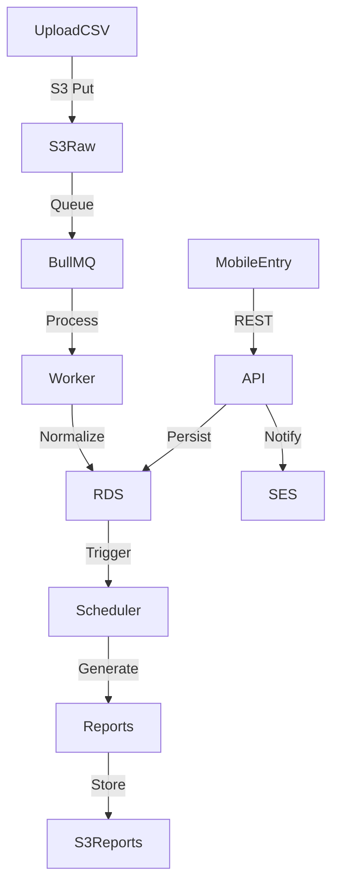

# Data Architecture

## Core Entities

- `stores` – metadata per store, region, operating hours
- `users` – Cognito user mapping, role assignments, store scopes
- `beauticians` – profile, commission rate, status
- `service_sessions` – service entry, store_id, beautician_id, duration, revenue, payment method
- `expected_service_sessions` – planned services/appointments with store_id, beautician_id, scheduled_time, expected revenue & duration
- `daily_revenue_entries` – normalized daily submissions, linked to uploaded files
- `cost_entries` – cost records, category, payer, allocation rule id
- `cash_handover_batches` – batch info, period, expected/actual, status, attachments
- `cash_handover_items` – linking service sessions to batch, variance detail
- `subsidies` – subsidy records per beautician/date
- `exceptions` – anomaly events, classification, status, assigned_to
- `reports` – cached report metadata with signed URLs
- `audit_logs` – append-only events stored in PostgreSQL partitioned table

## Data Flow Diagram



## Database Schema Snapshot (PostgreSQL)

```sql
CREATE TABLE stores (
  id UUID PRIMARY KEY,
  code TEXT UNIQUE NOT NULL,
  name TEXT NOT NULL,
  region TEXT,
  timezone TEXT NOT NULL DEFAULT 'Australia/Sydney',
  status TEXT NOT NULL DEFAULT 'active',
  created_at TIMESTAMPTZ NOT NULL DEFAULT NOW(),
  updated_at TIMESTAMPTZ NOT NULL DEFAULT NOW()
);

CREATE TABLE users (
  id UUID PRIMARY KEY,
  cognito_sub TEXT UNIQUE NOT NULL,
  email TEXT,
  phone TEXT,
  display_name TEXT,
  role TEXT NOT NULL CHECK (role IN ('partner','store_manager','beautician','finance')),
  store_scopes UUID[] NOT NULL DEFAULT '{}',
  status TEXT NOT NULL DEFAULT 'active',
  created_at TIMESTAMPTZ DEFAULT NOW()
);

CREATE TABLE service_sessions (
  id UUID PRIMARY KEY,
  store_id UUID REFERENCES stores(id),
  beautician_id UUID REFERENCES users(id),
  appointment_ref TEXT,
  service_date DATE NOT NULL,
  duration_minutes INT,
  customer_count INT DEFAULT 1,
  gross_revenue NUMERIC(12,2) NOT NULL,
  beautician_share NUMERIC(12,2) NOT NULL,
  subsidy NUMERIC(12,2) DEFAULT 0,
  net_revenue NUMERIC(12,2) NOT NULL,
  payment_method TEXT CHECK (payment_method IN ('cash','transfer','other')),
  entry_channel TEXT,
  exception_flag BOOLEAN DEFAULT FALSE,
  notes TEXT,
  created_at TIMESTAMPTZ DEFAULT NOW()
);

CREATE TABLE expected_service_sessions (
  id UUID PRIMARY KEY,
  store_id UUID REFERENCES stores(id) NOT NULL,
  beautician_id UUID REFERENCES users(id) NOT NULL,
  scheduled_start TIMESTAMPTZ NOT NULL,
  expected_duration_minutes INT,
  expected_revenue NUMERIC(12,2),
  service_type TEXT,
  status TEXT NOT NULL DEFAULT 'planned' CHECK (status IN ('planned','in_progress','completed','cancelled')),
  notes TEXT,
  created_by UUID REFERENCES users(id),
  created_at TIMESTAMPTZ DEFAULT NOW(),
  updated_at TIMESTAMPTZ DEFAULT NOW()
);

CREATE TABLE cash_handover_batches (
  id UUID PRIMARY KEY,
  store_id UUID REFERENCES stores(id),
  period_start DATE NOT NULL,
  period_end DATE NOT NULL,
  total_expected NUMERIC(12,2) NOT NULL,
  total_reported NUMERIC(12,2) NOT NULL,
  total_received NUMERIC(12,2) NOT NULL,
  variance NUMERIC(12,2) NOT NULL,
  variance_reason TEXT,
  status TEXT CHECK (status IN ('open','pending','closed')),
  handover_method TEXT,
  handover_channel TEXT,
  received_by UUID REFERENCES users(id),
  approved_by UUID REFERENCES users(id),
  recorded_by UUID REFERENCES users(id),
  recorded_at TIMESTAMPTZ DEFAULT NOW()
);
```

## Analytics & Aggregations

- Materialized views (`mv_daily_store_summary`, `mv_monthly_store_summary`) refreshed nightly via cron worker.
- Initial BI via Metabase (self-hosted) or AWS QuickSight (if budget allows); no Redshift until necessary.
