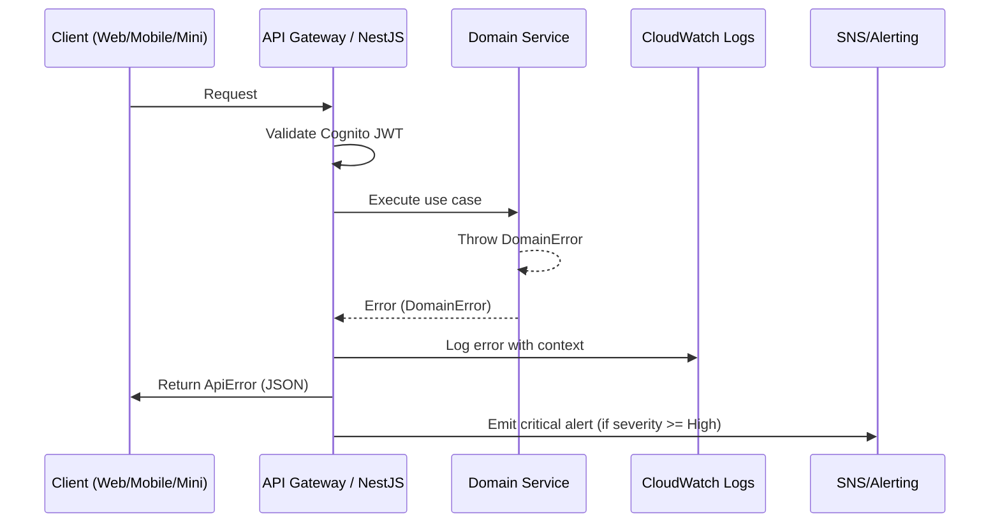

# Error Handling Strategy

## Error Flow (Mermaid)



## Error Response Format

```typescript
interface ApiError {
  error: {
    code: string;
    message: string;
    details?: Record<string, any>;
    timestamp: string;
    requestId: string;
  };
}
```

## Frontend Error Handling Snippet

```typescript
import { ApiError } from '@bms/domain';

export function handleApiError(err: unknown): ApiError {
  if (isAxiosError(err) && err.response?.data?.error) {
    const error = err.response.data.error as ApiError['error'];
    toast.error(error.message);
    return { error };
  }
  console.error('Unexpected error', err);
  toast.error('发生未知错误，请稍后再试。');
  return {
    error: {
      code: 'UNKNOWN',
      message: 'Unexpected error',
      timestamp: new Date().toISOString(),
      requestId: 'local',
    },
  };
}
```

## Backend Error Handler Snippet

```typescript
@Catch(DomainError)
export class DomainErrorFilter implements ExceptionFilter {
  catch(exception: DomainError, host: ArgumentsHost) {
    const ctx = host.switchToHttp();
    const response = ctx.getResponse<Response>();
    const request = ctx.getRequest<Request>();

    const payload = {
      error: {
        code: exception.code,
        message: exception.message,
        details: exception.details,
        timestamp: new Date().toISOString(),
        requestId: request.headers['x-request-id'] ?? randomUUID(),
      },
    } satisfies ApiError;

    logger.error(payload, { path: request.url, actor: request.user?.sub });
    response.status(exception.status).json(payload);
  }
}
```
