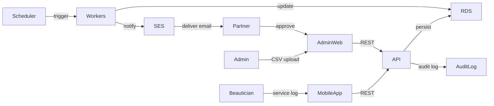

# Functional Architecture

## Domain Capability Breakdown

1. **Revenue Management**

   - Capture daily revenue per store & beautician (manual upload, future real-time)
   - Reconciliation against appointments, identify anomalies (under-reporting)
   - Generate daily close, trend analysis, service mix insights

2. **Appointment & Expectation Management**

   - Allow partners/store managers to register expected services/appointments with planned time, beautician, service type, and target revenue
   - Provide API/UI for editing, cancelling, and tracking fulfilment status
   - Feed comparison engine that powers anomaly detection and cash variance workflows

3. **Cost Management**

   - Manual/OCR cost entry, categorize by store & payer
   - Automatic allocation rules (per store) feeding profit calculations
   - Cost approval workflow, audit trail, supporting document storage

4. **Cash Flow & Settlement**

   - Cash handover batching, multi-day cycles, variance tracking
   - Profit split calculations (per partner) after cost allocation
   - Support for subsidy adjustments

5. **Exception & Compliance**
   - Anomaly detection rules (time, amount variance, missing handover)
   - Escalation workflow with audit logging

- Exportable compliance reports, immutable log in PostgreSQL audit partitions

6. **Analytics & Reporting**
   - Daily/Monthly summaries (predefined & custom queries)
   - Drill-down by store, beautician, category

- Export to Excel/PDF, scheduled delivery via SES email (WeChat optional in future)

7. **Authentication & Authorization**
   - Role-based access (Partner, Store Manager, Beautician, Finance)
   - Fine-grained store scoping, row-level filtering via JWT claims
   - Audit log for all sensitive operations

## User Journeys & Integration Points

- 合伙人或门店管理员在日初登记预约/预期服务 → API 保存 `ExpectedServiceSession` → 为当日对账提供基准。
- Beautician records service completion (mobile app) → API posts `ServiceSession` → triggers reconciliation jobs。
- Store manager uploads daily CSV via admin web → API processes batch → stores raw in S3, populates normalized tables。
- Comparison engine compares expected vs. actual sessions & cash → raises anomalies for partner review。
- Partner reviews daily dashboard → queries aggregated metrics via API → sees open exceptions, cash batch status。
- Finance triggers OCR pipeline for cost receipts → background worker queue processes job → updates cost ledger。
- Cash batch closed → API generates settlement report → S3 signed URL + SES email notification to partners。

## Solution Overview Diagram

