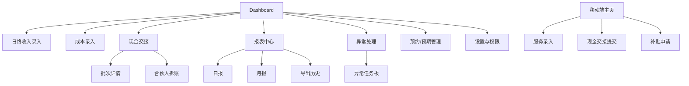
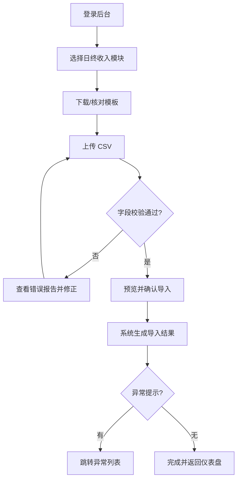
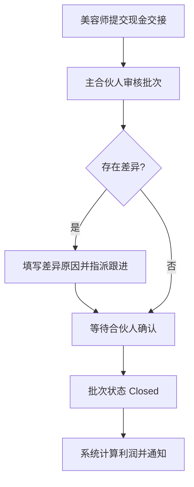
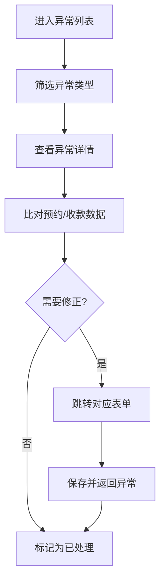
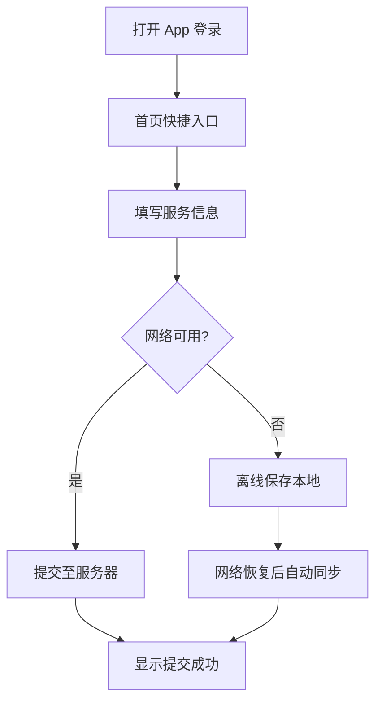

# beauty-shop-management-system UI/UX Specification

## Introduction

This document defines the user experience goals, information architecture, user flows, and visual design specifications for beauty-shop-management-system's user interface. It serves as the foundation for visual design and frontend development, ensuring a cohesive and user-centered experience.

### Overall UX Goals & Principles

#### Target User Personas

- **合伙人 / 财务负责人**：多门店投资人或财务主管，关注每日经营透明度、异常事件与利润分配；主要在 PC 或平板查看报表、审批交接。
- **门店管理员**：负责日终录入、成本、交接等操作，文化程度参差，偏向桌面操作但也可能使用移动端；需要极简流程和批量导入能力。
- **美容师**：自由合作模式下的服务人员，需通过移动 App 记录服务、补贴、现金交接；关注流程快、纠错容易。

#### Usability Goals

- 新用户（门店管理员）在 5 分钟内完成首次日终录入体验。
- 日常门店管理员在 10 分钟内完成当日批量导入、异常检查与提交。
- 美容师在 3 分钟内可提交一笔服务记录与现金交接。
- 合伙人每日查看核心报表的往返点击数控制在 5 次以内。

#### Design Principles

1. **任务导向**：所有界面直达业务任务（录入、交接、报表），减少无关元素干扰。
2. **错误可恢复**：重要操作提供清晰验证、撤销或提示，确保手工录入可纠错。
3. **跨端一致**：Web 与移动端共用设计 token、组件模式，保持视觉与交互一致。
4. **渐进披露**：默认展示关键指标，深入层级再查看详情，避免信息过载。

#### Change Log

| Date       | Version | Description                            | Author |
| ---------- | ------- | -------------------------------------- | ------ |
| 2025-09-25 | v0.1    | Initial UX goals, personas, principles | Sally  |

## Information Architecture (IA)

### Site Map / Screen Inventory

### Navigation Structure

**Primary Navigation:** 固定侧边栏（Dashboard、日终收入、成本、现金交接、报表中心、异常、预约管理、设置）。依据角色隐藏无权限菜单，并提供图标 + 文本。

**Secondary Navigation:** 顶部工具条用于环境切换、搜索、通知；报表/异常模块内部使用标签或子导航切换不同视图。

**Breadcrumb Strategy:** 在报表、异常详情等层级较深页面启用 `首页 / 模块 / 子页面` 面包屑，帮助用户定位。

## User Flows

### Flow 1：日终收入录入（批量 + 校验）

### Flow 2：现金交接审批

### Flow 3：异常复核

### Flow 4：美容师移动端服务录入

## Screen-by-Screen Specifications

### Dashboard / 仪表盘

- **Purpose:** 展示日常关键指标与待办事项，帮助合伙人/管理员即时掌握经营健康度。
- **Layout:** 顶部指标条（今日净收入、未交接现金、异常待处理）；中部两列卡片（左：趋势图与分店收入榜；右：异常与交接任务）；底部为最近批次与预约提醒表格。
- **Key Components:** KPI Summary Card、TrendChart、ExceptionCard、Quick Action Buttons、Notification Drawer。
- **States:** 正常、数据加载 Skeleton、异常高亮（颜色+图标）、空状态提供导入 CTA。

### 日终收入录入

- **Purpose:** 支持模板上传、逐条修正、提交结果并触发异常校验。
- **Layout:** 三步流程：1) 上传区（拖拽区+模板下载）；2) 预览区（可行内编辑的数据表格）；3) 结果区（成功/失败统计、导出错误）。
- **Key Components:** Stepper、Upload Dropzone、Editable Table、Validation Summary、Toast/Banner。
- **States:** 上传中（显示进度条）、校验失败（红色高亮错误行并提供导出错误 CSV）、校验成功（绿色勾）、提交后弹窗确认。

### 成本录入与分摊

- **Purpose:** 录入成本、配置分摊规则、查看分摊结果。
- **Layout:** 顶部过滤器 + 列表表格；右侧抽屉用于新增/编辑；底部条展示实时分摊汇总。
- **Key Components:** Filter Bar、Data Table、Drawer Form、Rule Chips、Summary Bar。
- **States:** 未设置分摊规则显示提示卡；保存成功/失败 Banner；无权限元素灰化并附说明。

### 现金交接列表 & 详情

- **Purpose:** 管理美容师到主合伙人与合伙人之间的现金交接与审批。
- **Layout:** 列表页支持卡片/表格切换、状态筛选；详情页双栏布局：左列金额对比与差异信息，右列审批时间线和操作按钮。
- **Key Components:** Status Tabs、Batch Card、Variance Highlight、Timeline、Action Buttons（批准/退回/指派）。
- **States:** Open/ Pending/ Closed 颜色标识；差异条目显著提示；审批完成显示通知 Banner。

### 报表中心

- **Purpose:** 查看日报/月报、异常报表，并导出或设置计划任务。
- **Layout:** 顶部筛选（日期、门店、维度），主体可切换“表格/图表”视图；右上角导出/计划按钮。
- **Key Components:** Date Picker、Store Selector、Data Table、Chart Switcher、Export Menu。
- **States:** 加载 Skeleton、空数据提示、导出成功/失败 Toast。

### 异常任务板

- **Purpose:** 追踪所有异常并指派处理。
- **Layout:** Kanban 栏（待处理/处理中/已解决）；卡片展示异常类型、金额、关联批次/服务链接。
- **Key Components:** Kanban Column、Exception Card、Assignee Selector、Comment Thread。
- **States:** 拖拽反馈（轻微缩放与阴影）、指派成功提示、空列显示鼓励文案。

### 预约/预期管理

- **Purpose:** 创建、编辑、追踪预期服务，为差异对账提供基准。
- **Layout:** 日历视图（周/月切换） + 列表视图；创建/编辑采用抽屉；列表支持批量操作。
- **Key Components:** Calendar View、List Table、Form Drawer、Status Badge。
- **States:** 状态徽章（planned/in_progress/completed/cancelled）；超时未完成高亮；匹配实际服务显示对勾。

### 移动端首页 & 服务录入

- **Purpose:** 让美容师快速查看待办并提交服务/交接记录。
- **Layout:** 首页展示待办卡片、快捷按钮；服务录入为分段表单（客户/服务/金额/现金），底部固定提交条。
- **Key Components:** Task Card、Quick Action、Segmented Form、Offline Indicator、Success Toast。
- **States:** 离线提示条、表单校验错误、保存离线/自动同步、提交成功。

## UI Components & Design System

- **Component Inventory:** Table（支持 Inline Edit）、Form（含 Stepper）、Drawer/Modal、Toast、Kanban Column、Card、Timeline、Tag/Badge、ChartCard、TrendChart、DonutChart、Calendar、Tabs、Notification Drawer。
- **Atomic Guidelines:**
  - Buttons：Primary（品牌主色）、Secondary（灰度）、Danger（红色）；圆角 8px，阴影柔和。尺寸分大/中/小，移动端默认大号。
  - Forms：统一使用浮动标签 + 实时验证；错误信息沿字段下方展示并使用红色提示。
  - Tables：支持多选、列固定与列宽拖拽；异常行以浅红背景突出。

### Typography

| Token | Size | Weight | Line Height |
| ----- | ---- | ------ | ----------- |
| H1    | 24px | 600    | 32px        |
| H2    | 20px | 600    | 28px        |
| H3    | 18px | 500    | 26px        |
| Body  | 14px | 400    | 22px        |
| Small | 12px | 400    | 18px        |

### Color Palette

- **Primary:** `#14B8A6`（青绿色，用于主要操作、链接，突出专业但有辨识度）
- **Secondary:** `#0F172A`（标题、正文深色）
- **Success:** `#10B981`
- **Warning:** `#F59E0B`
- **Danger:** `#EF4444`
- **Neutral:** 背景 `#F8FAFC`、边框 `#E2E8F0`、次级文本 `#64748B`

### Iconography

- **Icon Library:** Lucide Icons（Web）与 Expo Vector Icons（移动端），保持线性风格。
- **Usage Guidelines:** 功能图标大小统一为 24px，文字与图标间距 8px；状态图标使用对应语意色。

### Spacing & Layout

- **Grid System:** Web 端 12 列网格，基础间距 16px；移动端使用 4 列网格。
- **Spacing Scale:** 4px 基础步长，常用距离：4/8/12/16/24/32px。

## Accessibility Requirements

- **Standard:** 无正式法规约束（标记 None），但坚持基础可访问性实践。

**Visual:**

- 文本与背景对比度 ≥ 4.5:1；关键数据卡片 ≥ 7:1。
- 所有可点击元素提供明显的焦点态（描边或阴影）。
- 支持浏览器字体缩放至 125% 不破版。

**Interaction:**

- 后台流程可完全键盘操作，按照语义顺序聚焦。
- 重要反馈（导入成功、审批结果）使用 `aria-live` 公告；屏幕阅读器对表格、图表提供描述。
- 移动端触控目标 ≥ 44×44px。

**Content:**

- 图表附带文字摘要；图标提供 aria-label。
- 标题层级严格遵循 H1→H2→H3；表单字段具备显式标签。

**Testing Strategy:** Storybook + axe 自动检测；关键表单进行键盘无鼠标测试；移动端抽测 TalkBack/VoiceOver。

## Responsiveness Strategy

- **Breakpoints**

| Breakpoint | Min Width | Max Width | Target Devices        |
| ---------- | --------- | --------- | --------------------- |
| Mobile     | 0px       | 767px     | iPhone, Android Phone |
| Tablet     | 768px     | 1023px    | iPad, Android Tablet  |
| Desktop    | 1024px    | 1439px    | Laptop、标准桌面      |
| Wide       | 1440px    | -         | 宽屏财务显示器        |

- **Adaptation Patterns:**
  - 布局：移动端纵向单列，Tablet 分为上下两段，Desktop/Wide 使用 12 列网格并显示额外图表。
  - 导航：移动端采用抽屉 + 底部快捷按钮，桌面保持固定侧边栏；Tablet 视宽决定是否折叠。
  - 内容优先级：小屏默认展示待办与关键指标，延迟加载大型表格；大屏并列展示图表与明细。
  - 交互：移动端提供手势（左右滑动切换卡片）；桌面支持拖拽（Kanban、列表排序）。

## Animation & Micro-interactions

- **Motion Principles:** 控制在 200–300ms 的轻量过渡；强调反馈、避免影响输入性能；禁用过度闪烁以照顾低频使用者。
- **Key Animations:**
  - **ImportSuccessToast:** 导入成功提示淡入淡出（Duration: 250ms, Easing: ease-out）。
  - **KanbanDrag:** 异常卡片拖拽时轻微缩放 + 阴影增强（Duration: 200ms, Easing: ease-in-out）。
  - **ModalEntrance:** 抽屉/模态自右滑入并渐显（Duration: 220ms, Easing: ease-out）。

## Performance Considerations

- **Performance Goals:**
  - Page Load：Dashboard 首屏可交互时间 ≤ 3s。
  - Interaction：表单提交响应 ≤ 500ms（网络正常）。
  - Animation：保持 60fps，避免阻塞主线程。
- **Design Strategies:** 按需加载图表/报表模块；大表格使用虚拟滚动；移动端提供离线缓存与后台同步；Skeleton、占位符降低等待感；限制一次上传数据量并提供进度反馈。

## Related Documents

- **ASCII Layout Designs**: See [docs/ui-design/ascii-layouts.md](./ui-design/ascii-layouts.md) for detailed ASCII wireframes of all screens
- **UI Prompts**: See [docs/ui-prompts.md](./ui-prompts.md) for AI-ready UI generation prompts

## Next Steps

- **Immediate Actions**

  1. 与合伙人/门店代表审阅规范，验证可用性目标与流程。
  2. 在 Figma 建立高保真界面与组件库，应用上述设计 token。
  3. 规划上线前的可用性测试（含门店管理员、部分美容师）。

- **Design Handoff Checklist**
  - [ ] All user flows documented
  - [ ] Component inventory complete
  - [ ] Accessibility requirements defined
  - [ ] Responsive strategy clear
  - [ ] Brand guidelines incorporated
  - [ ] Performance goals established

## Checklist Results
